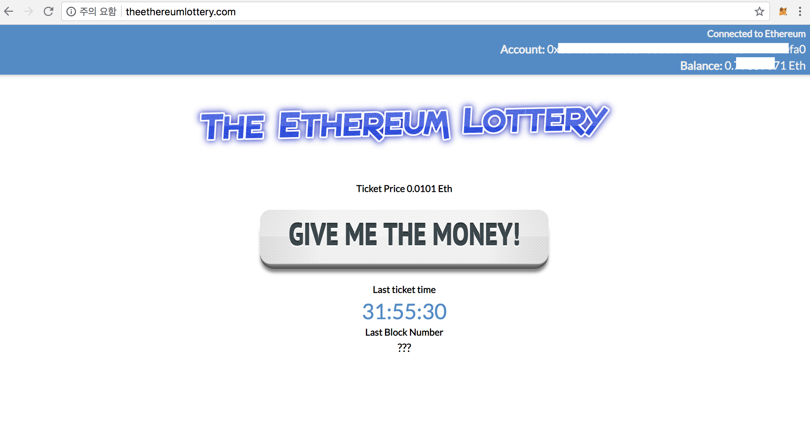

# CVE-2018-15552: Bad Randomness in TheEthereumLottery

## Abstract

We found a vulnerability in smart contract of ‘TheEthereumLottery’ which is an Ethereum lottery game. This game generates random numbers `maxTickets` with their own permutations which is easily predictable. Also, the developer use this variable with a `private` visibility. However, all variables in blockchain is not secret, so it can easily leaked.

## Details
‘TheEthereumLottery’ is a Ethereum lottery game. You can buy a lottery ticket with 0.0101 ether by clicking buttons of the website and automatically entered the lottery.


  *Figure 1. TheEthereumLottery Dapp Website*

  This lottery increases the variable `numTickets` when people buy tickets. When `numTickets` reaches the random number `maxTickets`, the person who bought the ticket wins.

```    
function AddTicket() public payable {
        require(msg.value == ticketPrice); 
        require(numtickets < maxTickets);
        
	//update bif
	lastTicketTime = now;
        numtickets += 1;
        totalBounty += ticketPrice;
        bool success = numtickets == maxTickets;
		
        NewTicket(msg.sender, success);
        
	//check if winner
        if(success) 
        {
            PayWinner(msg.sender);
        } 
    }
```

  TheEthereumLottery developer made `maxTickets` with own permutations. However, maxTickets are not random and predictable. As you can see in Line 105, the developer intended to make `maxTickets` unpredictable.
  
```
    function PayWinner( address winner ) private 
    { 
        require(numtickets == maxTickets);
        
	//calc reward
        uint ownerTax = 6 * totalBounty / 100;
        uint winnerPrice = totalBounty - ownerTax;
        
        LottoComplete(msg.sender, lottoIndex, winnerPrice);
         
	//reset values
        lottoIndex += 1;
        numtickets = 0;
        totalBounty = 0;
		
	//change max tickets to give unpredictability
	if(_direction == 0 && maxTickets < 20) maxTickets += 1;
	if(_direction == 1 && maxTickets > 10) maxTickets -= 1;
		
	if(_direction == 0 && maxTickets == 20) _direction = 1;
	if(_direction == 1 && maxTickets == 10) _direction = 0;
         
	//give real money
        worldOwner.transfer(ownerTax);
        winner.transfer(winnerPrice); 
    }
}
```

  Also, it can be accessed by "getStorageAt" function and the attacker can know which is the proper time to buy ticket.

## Exploit

  Below figure is the result of getStorageAt function. We can leak the private variable `maxTickets` easily.

  
  *Figure 2. The Result of getStorageAt() function*

## Conclusion

  Nothing is secret in the ethereum blockchain. Although developers use the `private` visibility in the variable, someone can check the contents of the variable. Also, solidity developers should carefully audit their code whether they use bad random number.
